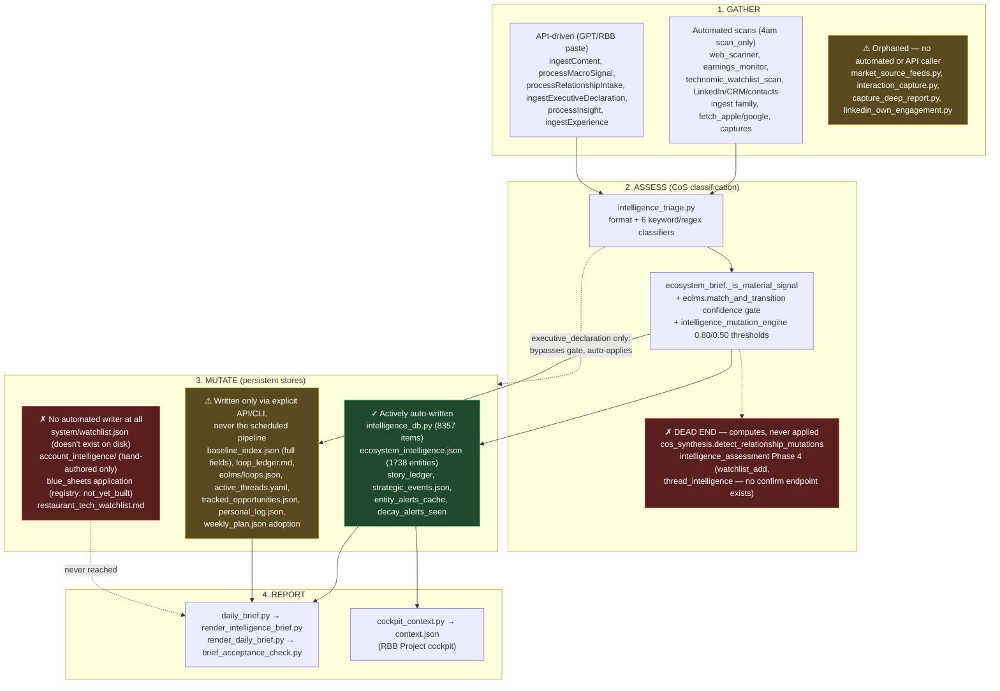

# Intelligence Pipeline Map — 2026-08-24

Todd's stated architecture (2026-08-24), verbatim intent:
1. Intelligence is gathered — automated scan or user input. **All input is always assessed for intelligence.**
2. Intelligence is assessed by the CoS.
3. Intelligence mutates all appropriate records in the persistent and queryable data files.
4. CoS reports or recommends based on the level of intelligence.

This doc maps every real entry point, assessment/mutation mechanism, and persistent store currently in the codebase against that four-stage model, built from three parallel Explore passes (gathering / assessment-mutation / persistent-stores) run 2026-08-24. Every claim below was traced to actual code (write calls, scheduled-step lists), not assumed from naming or docstrings alone.

---

## Flow diagram (high level)

---

## Stage 1: Gathering — full entry-point inventory

Two scheduled LaunchAgents drive automated gathering: **4:00 AM** `pre-brief-scan` (`morning_pipeline.py --mode scan_only`) and **5:00 AM** `morning-pipeline` (`--mode brief_only`, falls back to a full scan if caches are stale).

### Automated (in scan_steps / refresh_sources.py --all / refresh_all.py)
`fetch_apple_messages.py`, `fetch_apple_calls.py`, `fetch_google.py`, `web_scanner.py`, `passive_email_intelligence.py`, `earnings_monitor.py`, `entity_alerts.py`, `technomic_watchlist_scan.py`, `price_watch.py`, `capture_ingest.py`, `granola_capture.py`, `process_pending_captures.py`, `linkedin_export_watcher.py`, `hubspot_ingest.py`, `contacts_ingest.py`, `whatsapp_ingest.py`, `outlook_manual_ingest.py`, `social_content_mutation.py`, `sms_content_mutation.py`, `linkedin_session_reader.py --purge`, `intelligence_mutation_engine.py --refresh-ecosystem`, `market_signals.py --cache`, `passive_ri_ingest.py`.

### API-driven only (GPT/RBB call, no schedule)
`ingestContent`, `ingestExecutiveDeclaration`, `processMacroSignal`, `processRelationshipIntake`, `manualRelationshipIntake`, `reviewRIEvent`/`confirmRIEvent`, `processInsight`, `ingestExperience`, `ingestLinkedInExport`/`classifyArtifact`/`ingestLinkedInExtended`/`ingestLinkedInMessaging`/`processLinkedInSignal`, `uploadAndIngestFile`, `getCapturesPending`/`submitCapture`/`processAllCaptures`.

### ⚠ Manual CLI only — no automated or API caller found
- **`market_source_feeds.py`** — a real RSS trade-press feeder (writes `system/inbox/market_signals_feed.jsonl`) that every downstream module treats as a live source, but nothing calls its own `--fetch` step automatically or via API.
- **`interaction_capture.py`** — writer (`_emit_interaction_event`) is completely orphaned; only its reader is reused by `campaign_engine.py`.
- **`capture_deep_report.py`** — full narrative CoS report generator, on-demand only.
- **`linkedin_own_engagement.py`**, **`li_capture.py`** — LinkedIn's own-post engagement puller, manual-only (referenced as a documented recovery command, not scheduled).

---

## Stage 2: Assessment / Mutation — 16 mechanisms, confidence gates, and dead ends

### Real, working, auto-applying (no confirmation required)
| Mechanism | Gate | Writes to |
|---|---|---|
| `intelligence_triage.classify_executive_declaration` → `server.py::_execute_executive_declaration()` | CEO first-person statement regex match — always `authoritative` | `tracked_opportunities.json`, `active_threads.yaml`, `interaction_ledger.json`, `eolms/loops.json` (via item below), `personal_log.json` family |
| `eolms.match_and_transition()` | Token-overlap score ≥ 0.34 floor, ≥0.15 margin over 2nd-best (else `ambiguous`/`no_match`) | `eolms/loops.json` |
| `intelligence_mutation_engine.generate_mutations()` (via `sms_content_mutation.py`, `social_content_mutation.py`, `linkedin_freshness_bridge.py`) | Confidence ≥ 0.80 auto-applies, 0.50–0.79 proposed | `ecosystem_intelligence.json`, `executive_povs.json`, `baseline_index.json` (thesis_alignment only) |
| `ecosystem_brief.build_section()` / `_is_material_signal()` | `confidence in {high,medium} and signal_class in MATERIAL_SIGNAL_CLASSES` for *reporting*; broader `record_eligible` gate for *graph write* — runs on every brief build, **no confirmation gate at all** | `ecosystem_intelligence.json` (unconditional save whenever mutation_log non-empty) |
| `technomic_watchlist_scan.py` | None — explicitly unconditional, "the persistent trace for the 'if no, record it' half of Todd's rule" | `ecosystem_intelligence.json`, `entity_alerts_cache.json` |

### ✗ Confirmed dead ends — compute a real result, never applied
1. **✅ FIXED 2026-08-24.** ~~`intelligence_assessment.py` Phase 4~~ — `watchlist_add`/`thread_intelligence` proposals were computed correctly (real confidence scoring) but `sections["intelligence_assessment_summary"]` (trust stats + sustained patterns + these proposals) had no renderer at all in either brief pipeline. Fixed by adding `_render_intelligence_assessment_summary()` to `render_intelligence_brief.py` (new "Overnight Intelligence Scan" section) and correcting `_load_watchlist_entities()` to read the real `ecosystem_intelligence.json` `watch_list` instead of a `system/watchlist.json` that never existed. `watchlist_add` proposals already correctly instruct calling the real, working `getWatchList`/`updateWatchList` endpoint — no new mutation surface needed. `thread_intelligence` stays report-only (no safe existing apply target). 5 new tests.
2. **✅ FIXED 2026-08-24.** ~~`cos_synthesis.detect_relationship_mutations()`~~ — real classification, real confidence thresholds, but its only rendering path was a `rendering_rules` GPT-instruction list that `server.py`'s compact payload hardcodes to `[]` (dead since the pre-rendered-markdown pipeline superseded GPT-side generation). Fixed by adding `_render_proposed_relationship_mutations()` to `render_daily_brief.py`. Deliberately kept report-only, not auto-apply: no existing endpoint can safely apply a classification/tag upgrade to `baseline_index.json` today. 5 new tests.
3. **✅ FIXED 2026-08-24.** ~~`relationship_intake.py`'s `contact_upsert` proposal~~ — extended today's earlier last_touch-only fix to also apply the proposal's `tags` on the same `apply=True` + known-contact gate, via `mutations.cmd_contact_update()`. `current_company`/`current_role` deliberately left review-first, matching the established never-auto-overwrite-company-or-role convention already used by `linkedin_ingest.py`/`contacts_ingest.py`/`hubspot_ingest.py` elsewhere in this codebase. New `baseline_tags_status` result field. 3 new tests, plus 3 existing tests fixed for a real test-isolation gap this surfaced (they weren't mocking `cmd_contact_update`, which would have hit the live production baseline on every test run once this shipped).
4. **`intelligence_mutation_engine.refresh_ecosystem_daily()`** — ran successfully today, processed 528 rows from `EARNINGS_SIGNALS_PATH`/`MARKET_FEED_SIGNALS_PATH`, generated **zero** mutations. Only 9 mutations exist in `knowledge_mutations.json` ever. Since the *same engine* produces real mutations via the sms/social/linkedin-signal callers, the defect is specific to how this function maps earnings/market-feed rows into extractable text — not the engine itself. **This is the "why are we getting zero" question, still parked per Todd's instruction until after the gap-closing pass.**

### Held for confirmation, working as designed
`macro_intelligence.process_macro_signal()`, `insight_intake.process_text()`, `experiential_intelligence.process_experiential_signal()`, `opportunity_intake.py` (though this one has no confidence/materiality logic at all — always builds a full plan, gated purely on `confirm=True`), most of `relationship_intake.py`'s interaction-ledger flow (the ledger row itself writes eagerly; only its `claim_status` is gated).

---

## Stage 3: Persistent stores — health by category

### ✓ Actively, automatically written every scheduled run
`system/.cache/intelligence.db` (8,357 items, +33 today), `system/ecosystem_intelligence.json` (1,738 entities / 2,048 signals / 378 relationships), `system/.cache/story_ledger.json`, `system/strategic_events.json`, `system/.cache/entity_alerts_cache.json`, `system/.cache/decay_alerts_seen.json`, `system/.cache/watchlist_new_activity_seen.json`, `system/.cache/cos_action_engine.json`, `system/audit/*.jsonl` (as a byproduct of other scheduled scripts).

### ⚠ Written only via explicit API/CLI action — never the scheduled pipeline
`system/baseline_index.json` (full field application — only `last_touch` is automatic), `system/loop_ledger.md`, `system/eolms/loops.json` (both mutation owners API/CLI-reachable only — the one scheduled script that touches loops, `loop_autopilot.py --phase morning`, defaults to proposal-only, no `--apply`), `system/active_threads.yaml` (open/close have API endpoints; `update` is CLI-only, no API wiring at all), `system/tracked_opportunities.json`, `system/personal_log.json`, `system/interaction_ledger.json`, `system/weekly_plan.json` (draft auto-generates Mon/Fri; **adoption into the authoritative file is a separate, never-scheduled confirm step**), `system/_sessions/*.md`, `system/ri_events/*.jsonl` (real canonical events — only written when the scheduled run explicitly passes `--confirm-passive-ri`, which is **not the default**; the default run only populates a pending cache).

### ✗ No automated writer found at all
- **`system/watchlist.json`** — doesn't exist on disk. `watchlist_add` proposals are generated (see dead end #2 above) with nowhere to land even if a confirm path existed.
- **`system/account_intelligence/`** — the 24-doc ad-hoc research archive. No script generates or edits these files; purely hand-authored.
- **`system/restaurant_tech_watchlist.md`** — read everywhere as a reference doc, written nowhere.
- **Blue Sheet application** (`blue_sheets/accounts/*/`) — `CANONICAL_REGISTRY.yaml` states this verbatim: `mutation_owner: not_yet_built`. The only live automation is a coverage-*logging* hook (built 2026-08-22) that doesn't call the real `impact_review.process_event()` apply path.

---

## Governance gap, independent of any single mutation defect

**✅ FIXED 2026-08-24** (the `industry_ecosystem_intelligence` piece; the broader taxonomy question below remains open). `CANONICAL_REGISTRY.yaml`'s `mutation_owner` lists (the declared "who's authorized to write this domain") were stale relative to the actual codebase. `ecosystem_brief.py`, `technomic_watchlist_scan.py`, and `linkedin_freshness_bridge.py` were all confirmed writing directly to `industry_ecosystem_intelligence`'s authoritative store (`ecosystem_intelligence.json`) without being listed — added.

Still open, not addressed: `intelligence_triage.py`, `relationship_intake.py`, `opportunity_intake.py`, `macro_intelligence.py`, `insight_intake.py`, `cos_synthesis.py`, `intelligence_assessment.py` write to their own distinct stores (`interaction_ledger.json`, `behavioral_intelligence.json`, `conversation_insights.json`, etc.) that don't map cleanly onto the registry's 11 existing domains — closing this fully is a taxonomy design question (does each need its own domain, or fold into an existing one?), not a one-line accuracy fix, and was left out of today's pass for that reason.

---

## Candidate gap-closing priorities (for sequencing)

Roughly ordered by (confirmed real value) ÷ (scope/risk to fix), not by discovery order.

**Closed 2026-08-24:**
1. ✅ `watchlist_add`/`thread_intelligence` dead end.
2. ✅ `cos_synthesis.detect_relationship_mutations` dead end.
3. ✅ `relationship_intake.py`'s `contact_upsert` full application (tags half).
4. ✅ `CANONICAL_REGISTRY.yaml` `mutation_owner` accuracy pass (`industry_ecosystem_intelligence` domain).

**Closed 2026-08-24 (Todd's decisions):**
5. ✅ **`ri_events/*.jsonl` default-off gap** — `--confirm-passive-ri` now defaults to on in both `refresh_all.py` and `morning_pipeline.py` (escape hatch: `--no-confirm-passive-ri`). Existing safety gate unchanged (`_is_high_confidence_projection_safe`: signal type must be projection-safe, confidence must be high, contact must resolve to a known RC/LKI baseline entry).
6. ✅ **`weekly_plan.json` adoption step** — new `auto_adopt_if_monday_eod()` in `weekly_plan_generator.py`, wired to a new Monday-8pm LaunchAgent (`com.relationshipbuilder.weekly-plan-eod-adopt`). Never overrides an explicit confirm/reject. **Also fixed in the same pass:** `weekly_planning.save_plan()` had zero snapshot/backup mechanism at all — found the hard way when a live test promoted this week's real draft ~8 hours early with no way to revert. Snapshot now taken before every write, matching every other mutation path in this codebase.
7. ✅ **`market_source_feeds.py` orphaned fetch step** — new `refresh_market_feeds()` in `refresh_sources.py`, runs before `refresh_market()` whenever `--market`/`--all` is passed. Confirmed `market_signals.py` already merges its output file (`market_signals_feed.jsonl`) in — this was purely a "nothing populates the file" gap, not a disconnected pair of scripts.

**Large, unparked 2026-08-24 (Todd: "let's un park it"):**
8. **Blue Sheet application wiring** and **full `accounts`/`opportunities` domain consolidation** — was parked 2026-08-21, unparked today. Not yet started; largest scope of everything on this list.

**New work requested 2026-08-24 (not part of the original gap list):**
9a. **`refresh_ecosystem_daily()` zero-mutation root cause** — the original "why are we getting zero" question, still to do.
9b. **Friday end-of-week routine** — new: review weekly plan, close loops, surface important reminders/actions from the week, and confirm documentation/Blue Sheets/records are up to date and backed up. Not yet started.
